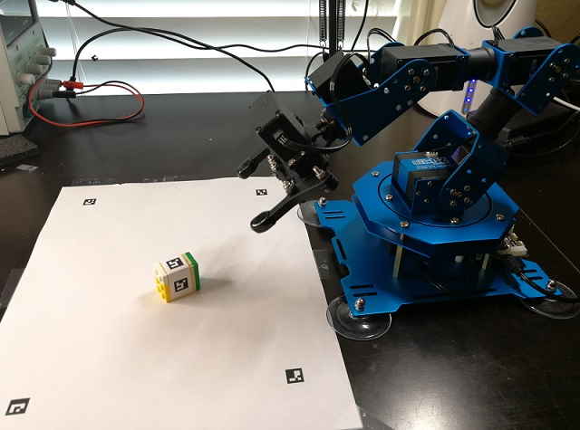

# xArm Cube Pickup #
This repo contains python scripts to demonstrate  cube pick up using [xArm](https://www.hiwonder.hk/products/xarm-1s-hiwonder-intelligent-bus-servo-robotic-arm-for-programming).
It utilites OPENCV to locate the cube from the images captured by the webcam, and then it caculates the required arm joints angles to plan the pick up motions.

## Setup Steps ##

- Clone this repo to a working directory

- Print [maker PDF file] (image/markers.pdf).
  This pdf has two sheets. The 1st sheet contains markers for the pickup area identification. It can be used to locate
  the four corners of the pickup area. Once printed, the whole page can be taped onto the desktop.  The 2nd page contains
  markers for the cube identification. Individual marker can be cut off and then taped onto the 6 faces of the cube.
  I just used a LEGO block instead.

- Install required python modules using pip, such as pybullet, hidapi, opencv-python, scipy, numpy, etc

- Power up xArm hardware and connect it to host through USB cable.

- Connect webcam and adjust the position so that the four corner markers on the sheet can all be clearly seen.
  At the same time, try to keep the picking area big enough in the camera view.

- Calibrate the xArm servos:

    python xarm_calibrate.py

- Run xArm cube picking up demo:

    python xarm_pickup.py

  Now place the cube at any place on the picking area, and the arm should automatically move to pick it up and then drop it on the side.

## Acknowledgements ##

- The robot control, calibration and moving path planning are from David Klee's [nuro-arm](https://github.com/dmklee/nuro-arm) project.
  Great thanks to David for sharing his great work on the robotics programming.
